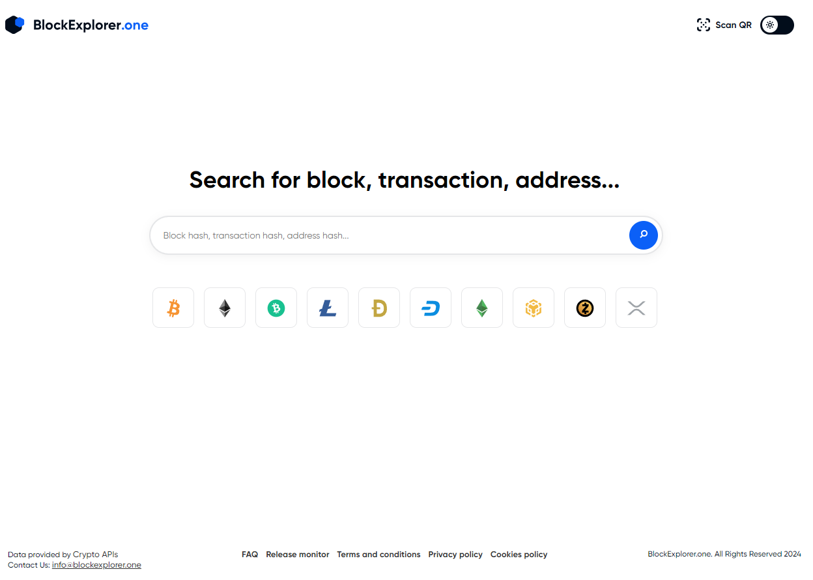

# Criando e utilizando a minha primeira carteira de criptomoedas

Nesse desafio vou criar um gerador de carteiras bitcoin, utilizando pares de chave pública e privada. Eu irei desenvolver um gerador para criar endereços de depósito e de envio de bitcoin para a carteira gerada.

## Requisitos

Para executar o gerador de carteiras bitcoin, eu precisei dos seguintes requisitos instalados em meu sistema:

- Node.js versão 16 ou superior
- npm (Node Package Manager)

## Clonando o repositório

```
git clone [https://github.com/yohanaff/dio-criando-e-utilizando-a-sua-carteira-de-criptomoedas.git]
```
## Executando o projeto

```
cd src
node createWallet.js
```
O output será a carteira gerada, junto com o seu endereço, chave privada e seed.


## Buscando o meu bloco em um buscador de blocos. 

Acessei o blockexplorer.one [blockexplorer.one](https://blockexplorer.one/).

1. Cliquei no ícone do Bitcoin.


2. Digitei no buscador o endereço da minha carteira.

Observei que ali há um alerta falando que se trata um endereço testnet.

Observei também que não há nenhuma transação e o saldo está zerado.


## Obtendo faucets (criptomoedas de teste)

1. Acessei [coinfaucet.eu](https://coinfaucet.eu/).

2. Coloquei o endereço da minha carteira.

Mostrou uma tela como esta:


## Confirmando a transação (criptomoedas de teste)

Acessei o live.blockcypher.com/btc-testnet/

E inseri o código tx da transação realizada.


