# Criando e utilizando a sua primeira carteira de criptomoedas

Nesse desafio vamos criar um gerador de carteiras bitcoin, utilizando pares de chave pública e privada. Você irá desenvolver um gerador para criar endereços de depósito e de envio de bitcoin para a carteira gerada. Além disso, vamos importar essa carteira dentro do Electrum, um aplicativo desktop pra enviar e receber transações em bitcoin, e por fim enviar criptomoedas.

## Requisitos

Para executar o gerador de carteiras bitcoin e importá-las no Electrum, você precisará ter os seguintes requisitos instalados em seu sistema:

- Node.js versão 16 ou superior
- npm (Node Package Manager)
- Electrum (aplicativo desktop para enviar e receber transações em bitcoin)

Certifique-se de ter esses requisitos instalados antes de prosseguir.

## Clonando o repositório

```
git clone https://github.com/yohanaff/dio-criando-e-utilizando-a-sua-carteira-de-criptomoedas.git
```
## Executando o projeto

```
cd src
node createWallet.js
```
O output será a carteira gerada, junto com o seu endereço, chave privada e seed.

## Importando a carteira no Electrum

1. Abra o Electrum e clique em "Criar uma nova carteira"
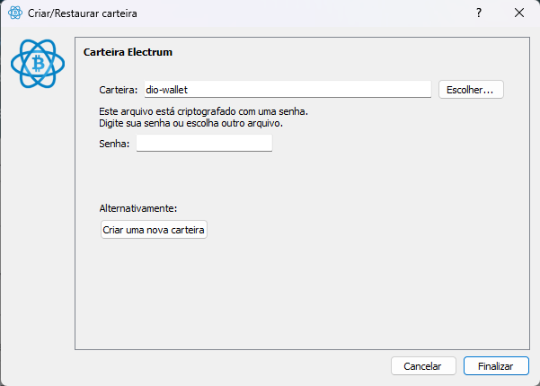

2. Dê um nome à carteira e clique em "Próximo"
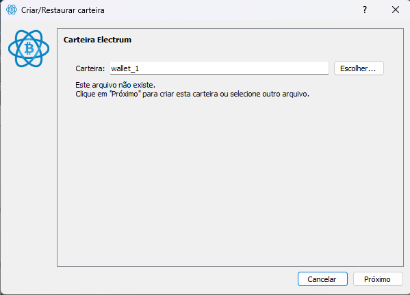

3. Selecione "Carteira padrão" e clique em "Próximo"
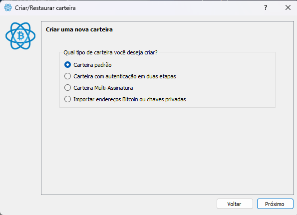

4. Selecione "Crie uma nova semente" e clique em "Próximo"
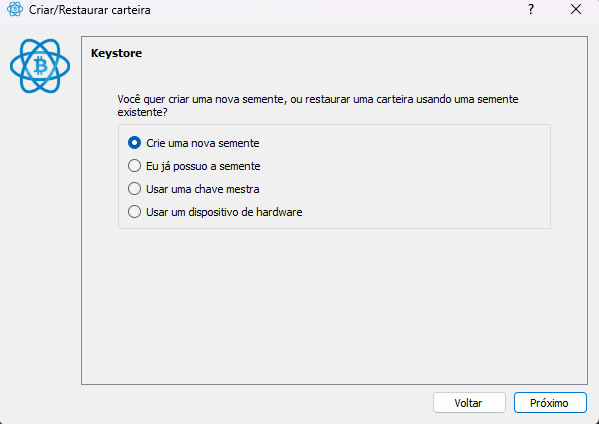

5. Selecione o texto (seed) e copie para um bloco de notas. Clique em "Próximo".
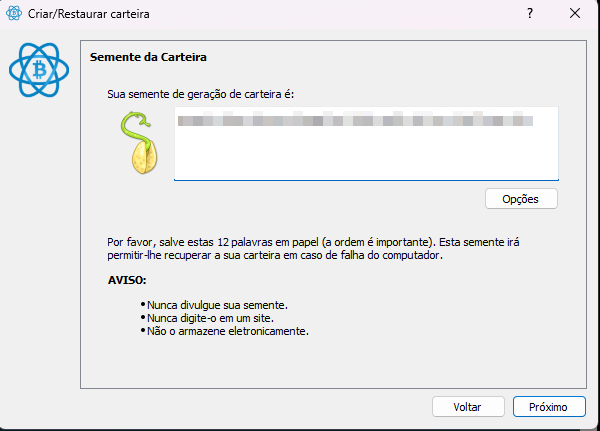

6. Escreva o texto (seed) copiado no bloco abaixo e clique em "Próximo"
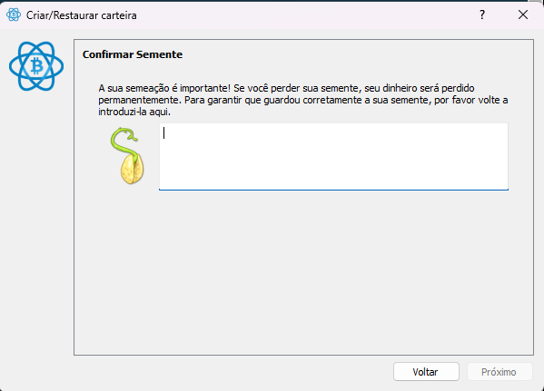

7. Digite uma senha e clique em "Finalizar"
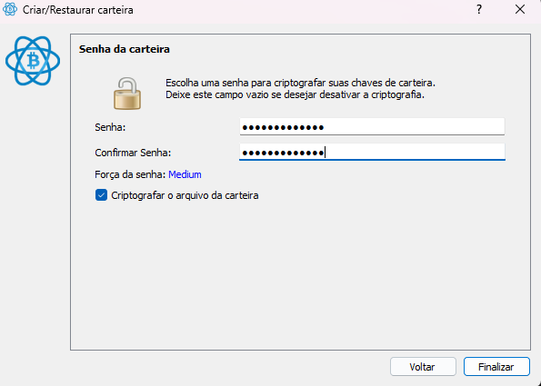

8. Pronto! Você criou a sua carteira dentro do Electrum.
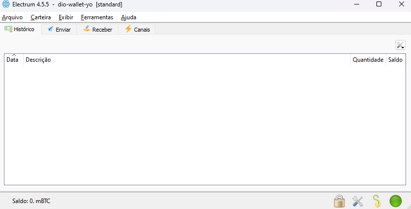


## Buscando o seu bloco em um buscador de blocos. 

Acesse o [blockchain.com](https://www.blockchain.com/explorer) ou [blockexplorer.one](https://blockexplorer.one/). Abaixo há um exemplo usando a segunda alternativa:

1. Clique no ícone do Bitcoin.


2. Digite no buscador o endereço da sua carteira.
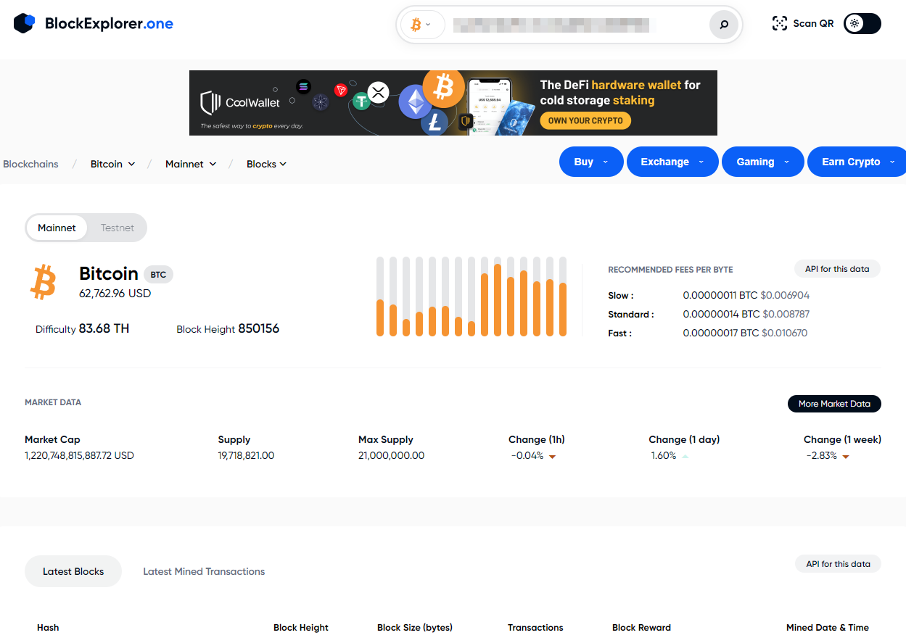

Observe que ali há um alerta falando que é um endereço testnet.
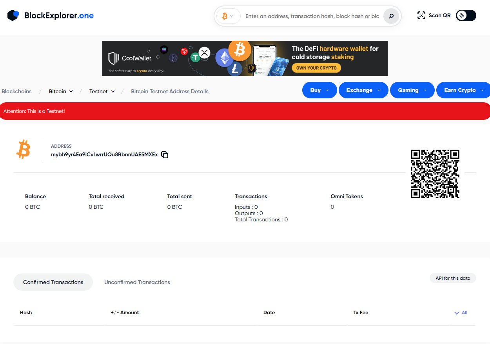

Observe também que não há nenhuma transação e o saldo está zerado.

## Obtendo faucets (criptomoedas de teste)

1. Acesse [coinfaucet.eu](https://coinfaucet.eu/).

2. Coloque o endereço da sua carteira.
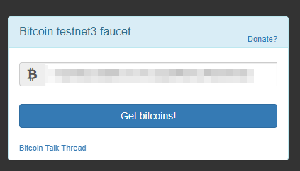

Mostrará uma tela como esta:
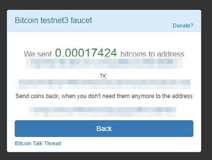

Agora você pode atualizar a página do seu buscador de blocos e verificar que há uma transação feita:

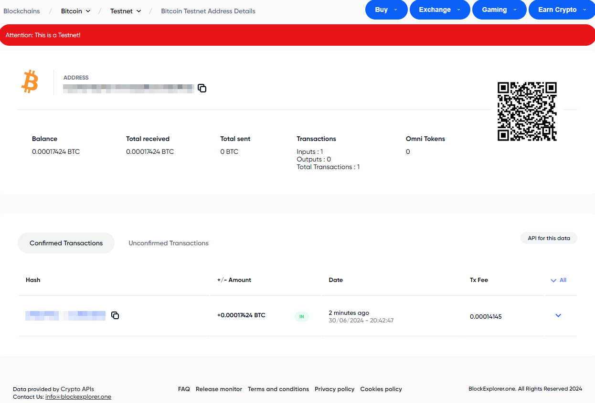

## Ativando a testnet no Electrum

1. Abra o Electrum Testnet e crie uma nova carteira; clique em "Próximo".
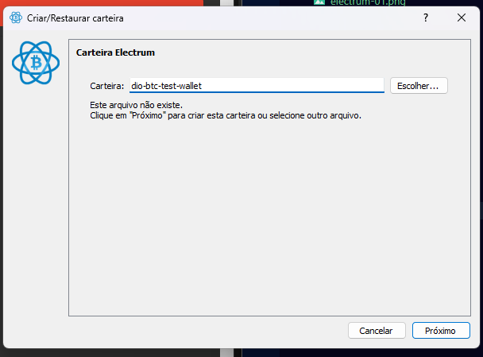

2. Selecione "Importar endereços Bitcoin ou chaves privadas".
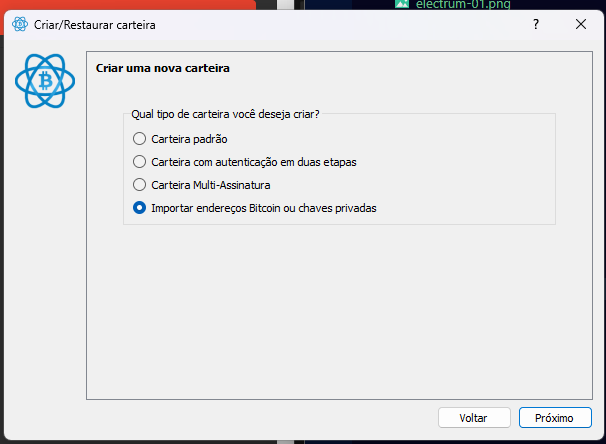

3. Copie a chave privada da sua carteira e cole no campo abaixo.
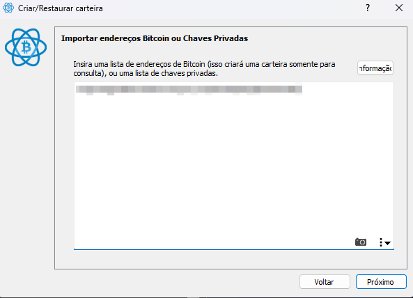

4. Crie uma senha e clique em finalizar.
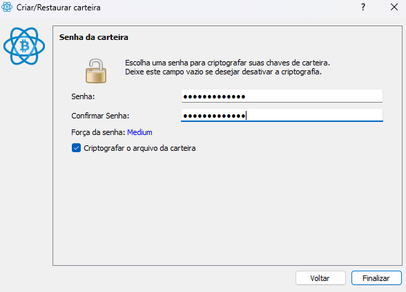

Você verá um alerta avisando que você está no modo de teste, clique em "OK". Agora você poderá ver a transação feita anteriormente.
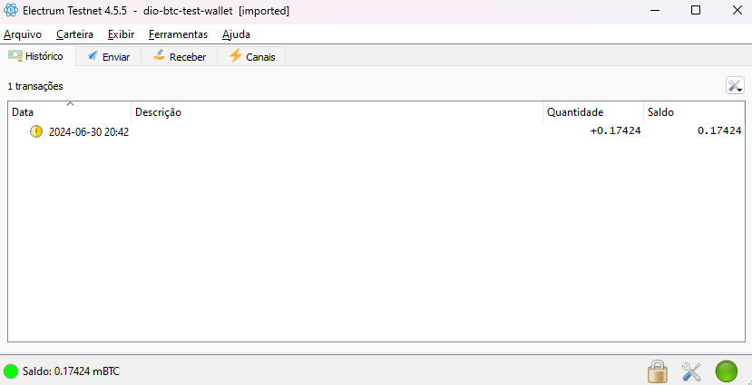

Após a sua transação ser validada, você poderá enviar essa criptomoeda para outras carteiras.

## Enviando criptomoedas

1. Repita o [seguinte passo ](#executando-o-projeto).

2. Copie o novo endereço gerado.

3. Clique na tab "Enviar" e cole o endereço que você copiou. Escolha a quantidade de criptomoedas que vai enviar; clique em "Pagar".
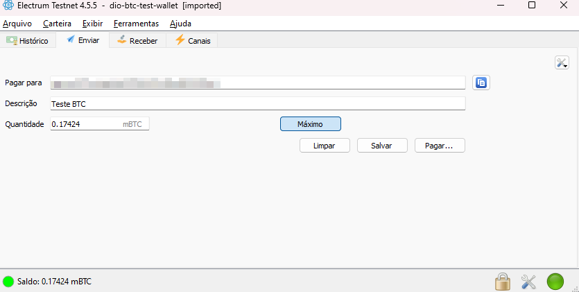

4. Escolha a taxa de transação (quanto maior, mais rápida), clique em "Concluído" e digite a sua senha.
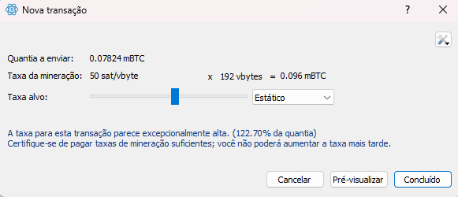

Em seguida, você vai receber a mensagem de que o pagamento foi enviado:

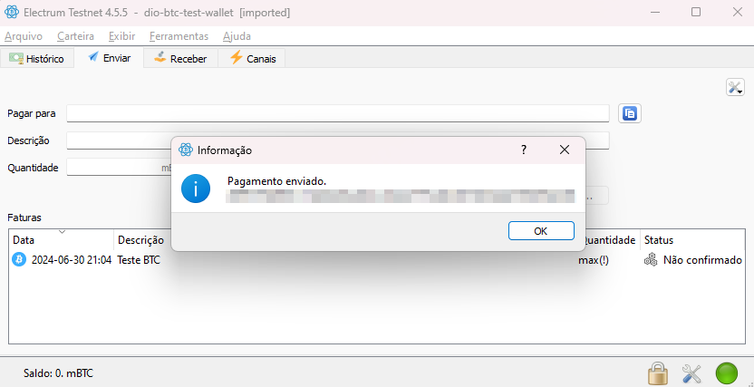

Após a transação ser confirmada, você poderá vê-la no buscador de blocos :)
